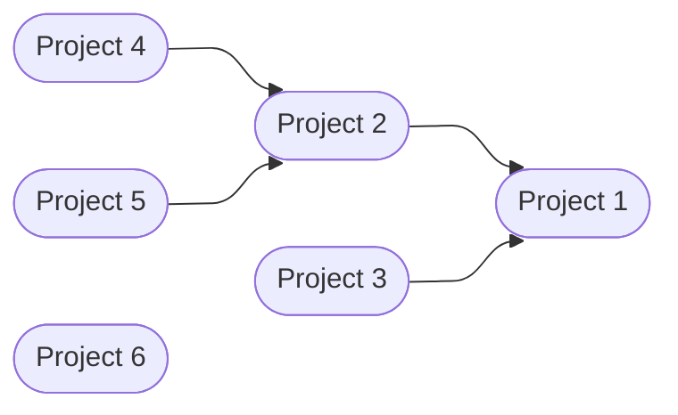

# Project references test

This folder contains a project with project references. It's used for end-to-end
testing of the project references parallelisation functionality. The dependency
graph is as follows:

